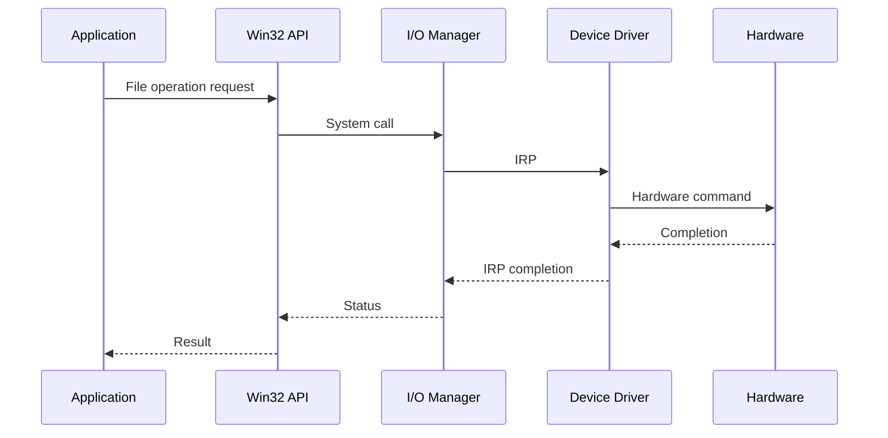

การติดตั้งและทดสอบ I/O (I/O Setup and Testing)

### 🎯 วัตถุประสงค์ของบทเรียนที่ 3

- เข้าใจ Windows I/O System และการทำงาน
- กำหนดค่า disk configuration ให้เหมาะสมกับ SQL Server
- ใช้เครื่องมือทดสอบประสิทธิภาพ I/O
- วิเคราะห์และแปรผลการทดสอบ

### 3.1 Windows I/O System

#### 🔍 สถาปัตยกรรม Windows I/O

```
User Mode Applications
         ↓
    Win32 API
         ↓
Windows I/O Manager (Kernel Mode)
         ↓
Device Drivers
         ↓
Hardware Abstraction Layer (HAL)
         ↓
Storage Hardware
```

#### 📡 I/O Request Packet (IRP)

**IRP** เป็นโครงสร้างข้อมูลที่ใช้สื่อสารระหว่างส่วนประกอบต่างๆ ใน I/O system

```yaml
IRP ประกอบด้วย:
  - Operation type: Read, Write, Open, Close
  - Buffer information: ที่อยู่และขนาดข้อมูล
  - Status information: สถานะการทำงาน
  - Completion routine: function เมื่อเสร็จสิ้น
```

#### 🔄 กระบวนการ I/O



### 3.2 ประเภทของดิสก์ (Disk Types)

#### 💾 Basic Disks

**คุณสมบัติ:**
- รองรับตั้งแต่ MS-DOS
- ใช้ Master Boot Record (MBR) หรือ GUID Partition Table (GPT)
- จำกัดการขยายตัว

**ประเภท Partition:**
```yaml
Primary Partition:
  - สูงสุด 4 partitions ใน MBR
  - สามารถ boot ได้
  - เหมาะสำหรับ OS

Extended Partition:
  - แบ่งเป็น logical drives
  - ไม่สามารถ boot ได้
  - เหมาะสำหรับ data
```

#### 🔄 Dynamic Disks

**คุณสมบัติ:**
- รองรับ software RAID
- ยืดหยุ่นในการจัดการ
- สามารถขยาย volume ได้

**ประเภท Volume:**
```yaml
Simple Volume:
  - เหมือน primary partition
  - ไม่มีการป้องกัน

Spanned Volume:
  - รวมหลาย disks
  - ไม่มีการป้องกัน

Striped Volume (RAID 0):
  - แบ่งข้อมูลหลาย disks
  - ประสิทธิภาพสูง

Mirrored Volume (RAID 1):
  - สำรองข้อมูล
  - ความปลอดภัยสูง

RAID-5 Volume:
  - Parity สำหรับกู้คืน
  - ประหยัดพื้นที่
```

### 3.3 Mount Points

#### 🔍 ความหมายและประโยชน์

**Mount Points** ช่วยให้สามารถเข้าถึง volume ผ่าน folder path แทนการใช้ drive letter

#### ✅ ข้อดีของ Mount Points

| ข้อดี | คำอธิบาย | ตัวอย่าง |
|-------|----------|----------|
| **ไม่จำกัด 26 letters** | ไม่ต้องพึ่ง A-Z | มี volumes มากกว่า 26 ตัว |
| **Logical organization** | จัดกลุ่มตามการใช้งาน | C:\SQL\Data, C:\SQL\Log |
| **Transparent access** | Applications ไม่รู้ว่าเป็น mount point | ง่ายต่อการย้าย volume |

#### 💻 ตัวอย่างการใช้งาน

```powershell
# สร้าง mount point
New-Item -Path "C:\SQL\Data" -ItemType Directory
# Mount volume ไปยัง folder
mountvol C:\SQL\Data \\?\Volume{12345678-1234-1234-1234-123456789012}\

# ตัวอย่าง folder structure
C:\SQL\
├── Data\     ← Mount point to Volume 1 (Data files)
├── Log\      ← Mount point to Volume 2 (Log files)
├── TempDB\   ← Mount point to Volume 3 (TempDB files)
└── Backup\   ← Mount point to Volume 4 (Backup files)
```

### 3.4 Partition Alignment และ NTFS Allocation Unit Size

#### 🎯 Partition Alignment

**ความสำคัญ:**
- Misaligned partitions ทำให้ 1 I/O operation กลายเป็น 2 operations
- ส่งผลต่อประสิทธิภาพอย่างมาก

#### 📊 การตรวจสอบ Partition Alignment

```powershell
# ตรวจสอบ alignment ด้วย PowerShell
Get-WmiObject -Class Win32_DiskPartition | 
    Select-Object Name, StartingOffset, Size | 
    ForEach-Object {
        $alignment = $_.StartingOffset % 4096
        [PSCustomObject]@{
            Name = $_.Name
            StartingOffset = $_.StartingOffset
            Size = $_.Size
            Aligned = ($alignment -eq 0)
            AlignmentOffset = $alignment
        }
    }

# ตรวจสอบด้วย wmic (สำหรับ basic disks)
wmic partition get BlockSize, StartingOffset, Name, Index
```

#### 🔧 การแก้ไข Misalignment

```powershell
# การสร้าง partition ใหม่ที่ aligned
# โดยใช้ Disk Management หรือ diskpart

# ตัวอย่าง diskpart commands
diskpart
select disk 1
clean
create partition primary align=1024
active
format fs=ntfs unit=64k quick label="SQL Data"
assign letter=D
```

#### 📦 NTFS Allocation Unit Size

**ค่าเริ่มต้น:** 4 KB
**ค่าแนะนำสำหรับ SQL Server:** 64 KB

**เหตุผล:**
- SQL Server ใช้ page size 8 KB
- Extent = 8 pages = 64 KB
- Read-ahead reads ทำงานเป็น extent
- ประสิทธิภาพดีขึ้นเมื่อ allocation unit = extent size

#### 💻 การกำหนด Allocation Unit Size

```powershell
# Format disk ด้วย 64 KB allocation unit
Format-Volume -DriveLetter D -FileSystem NTFS -AllocationUnitSize 65536 -NewFileSystemLabel "SQL Data"

# หรือใช้ command line
format D: /FS:NTFS /A:64K /Q /V:"SQL Data"
```

#### ⚠️ หมายเหตุสำคัญ

```yaml
ข้อควรระวัง:
  - Native NTFS compression ใช้ไม่ได้กับ allocation unit > 4 KB
  - ไม่แนะนำให้ใช้ NTFS compression กับ SQL Server files
  - Unbuffered I/O (SQL Server ใช้) ไม่ได้รับผลกระทบจาก allocation unit size
  - ส่วนใหญ่ SQL Server ใช้ unbuffered I/O
```

### 3.5 การทดสอบประสิทธิภาพด้วย Diskspd

#### 🔍 ความหมายและความสำคัญ

**Diskspd** เป็นเครื่องมือของ Microsoft สำหรับ load generation และ performance testing ของ storage I/O subsystems

#### 📥 การติดตั้งและเตรียมความพร้อม

```powershell
# Download Diskspd จาก Microsoft
# https://github.com/Microsoft/diskspd

# Extract และใช้งาน
cd C:\Tools\diskspd
.\diskspd.exe --help
```

#### 🛠️ พารามิเตอร์หลักของ Diskspd

| พารามิเตอร์ | คำอธิบาย | ตัวอย่าง |
|-------------|-----------|----------|
| **-d** | ระยะเวลาทดสอบ (วินาที) | -d300 (5 นาที) |
| **-c** | ขนาดไฟล์ทดสอบ | -c10G (10 GB) |
| **-w** | เปอร์เซ็นต์การเขียน | -w30 (30% writes, 70% reads) |
| **-r** | Random I/O | -r (แทน sequential) |
| **-s** | Sequential I/O | -s (แทน random) |
| **-t** | จำนวน threads | -t8 (8 threads) |
| **-o** | Outstanding I/O requests | -o32 (32 pending I/Os) |
| **-b** | Block size | -b64K (64 KB blocks) |
| **-L** | วัด latency statistics | -L |
| **-h** | ปิด hardware/software cache | -h |

#### 📊 ตัวอย่างการทดสอบต่างๆ

##### ทดสอบ OLTP Workload (Random I/O)
```powershell
# สถานการณ์: OLTP database กับ mixed read/write
diskspd.exe -c5G -d300 -r -w20 -t8 -o8 -b8K -h -L D:\testfile.dat

# ความหมาย:
# -c5G: ไฟล์ทดสอบ 5 GB
# -d300: ทดสอบ 5 นาที
# -r: Random I/O
# -w20: 20% writes, 80% reads
# -t8: 8 threads
# -o8: 8 outstanding I/Os
# -b8K: Block size 8 KB (SQL Server page size)
# -h: ปิด caching
# -L: วัด latency
```

##### ทดสอบ Data Warehouse Workload (Sequential Read)
```powershell
# สถานการณ์: การสแกนตารางขนาดใหญ่
diskspd.exe -c10G -d180 -s -w0 -t4 -o16 -b64K -h -L D:\testfile.dat

# ความหมาย:
# -c10G: ไฟล์ทดสอบ 10 GB
# -d180: ทดสอบ 3 นาที
# -s: Sequential I/O
# -w0: 100% reads
# -t4: 4 threads
# -o16: 16 outstanding I/Os
# -b64K: Block size 64 KB (extent size)
```

##### ทดสอบ Transaction Log Workload (Sequential Write)
```powershell
# สถานการณ์: การเขียน transaction log
diskspd.exe -c2G -d120 -s -w100 -t1 -o1 -b8K -h -L L:\testfile.dat

# ความหมาย:
# -c2G: ไฟล์ทดสอบ 2 GB
# -d120: ทดสอบ 2 นาที
# -s: Sequential I/O
# -w100: 100% writes
# -t1: 1 thread (log writes are typically single-threaded)
# -o1: 1 outstanding I/O (synchronous writes)
# -b8K: Block size 8 KB
```

#### 📈 การแปรผลการทดสอบ

##### ตัวอย่าง Output จาก Diskspd

```
Command Line: diskspd.exe -c5G -d300 -r -w20 -t8 -o8 -b8K -h -L D:\testfile.dat

Input parameters:
        timespan:   5m
        duration:   300s
        warm up:    5s
        cool down:  5s
        measuring:  300s
        path:       'D:\testfile.dat'
                file size:   5368709120 (5.00 GiB)
                random seed: 0
        access:     random
        pattern:    (8.0 KiB, 20% write, 80% read, 0% flush)
        threading:  8 threads
        ioqueue:    8 outstanding IOs per thread

CPU |  Usage |  User  |  Kernel |  Idle
----|--------|--------|---------|-------
   0|  45.23 |  12.34 |   32.89 |  54.77
   1|  43.67 |  11.89 |   31.78 |  56.33
   Total| 44.45|  12.12|   32.34|  55.55

Total IO
thread |       bytes     |     I/Os    |    MiB/s   |  I/O per s |  AvgLat  | IopsStdDev
---------------------------------------------------------------------
     0 |      2097152000 |      256000 |      6.99  |     853.33 |    9.37  |      12.45
     1 |      2088960000 |      255000 |      6.96  |     850.00 |    9.41  |      12.67
   ...
total  |     16777216000 |     2048000 |     55.92  |    6826.67 |    9.39  |     102.34

Read IO
thread |       bytes     |     I/Os    |    MiB/s   |  I/O per s |  AvgLat  | IopsStdDev
---------------------------------------------------------------------
     0 |      1677721600 |      204800 |      5.59  |     682.67 |    7.23  |       9.87
   ...
total  |     13421772800 |     1638400 |     44.74  |    5461.33 |    7.25  |      81.23

Write IO
thread |       bytes     |     I/Os    |    MiB/s   |  I/O per s |  AvgLat  | IopsStdDev
---------------------------------------------------------------------
     0 |       419430400 |       51200 |      1.40  |     170.67 |   18.45  |       3.21
   ...
total  |      3355443200 |      409600 |     11.18  |    1365.33 |   18.47  |      21.11

Latency Percentiles:
Total:
   min | 25th | 50th | 75th | 90th | 95th | 99th | 99.9th | max
   1.2 |  4.5 |  7.8 | 12.3 | 18.7 | 23.4 | 34.5 |   45.6 | 67.8

Read:
   min | 25th | 50th | 75th | 90th | 95th | 99th | 99.9th | max
   1.0 |  3.2 |  6.1 |  9.8 | 14.2 | 17.8 | 26.7 |   35.4 | 52.3

Write:
   min | 25th | 50th | 75th | 90th | 95th | 99th | 99.9th | max
   2.1 |  8.9 | 15.4 | 23.1 | 32.4 | 38.7 | 51.2 |   62.8 | 89.1
```

##### การวิเคราะห์ผลลัพธ์

```yaml
ตัวชี้วัดสำคัญ:

IOPS (I/O per second):
  - Total: 6,826.67 IOPS
  - Read: 5,461.33 IOPS  
  - Write: 1,365.33 IOPS
  การแปรผล: เปรียบเทียบกับความต้องการของ application

Throughput (MiB/s):
  - Total: 55.92 MiB/s
  - Read: 44.74 MiB/s
  - Write: 11.18 MiB/s
  การแปรผล: เพียงพอสำหรับ backup/restore หรือไม่?

Latency (AvgLat):
  - Read: 7.25 ms (ดีมาก สำหรับ OLTP)
  - Write: 18.47 ms (ยอมรับได้ แต่อาจต้องปรับปรุง)
  การแปรผล: เปรียบเทียบกับเกณฑ์ Microsoft

CPU Usage:
  - Total: 44.45%
  การแปรผล: ยังมี headroom สำหรับ workload อื่น

Latency Percentiles:
  - 95th percentile: สำคัญสำหรับ SLA
  - 99th percentile: สำคัญสำหรับ worst case scenario
```

#### 🎯 แนวทางการทดสอบที่ดี

##### การเตรียมการทดสอบ

```yaml
ก่อนทดสอบ:
  1. หยุด SQL Server services
  2. ปิด antivirus real-time scanning
  3. ตรวจสอบ CPU และ memory utilization
  4. ใช้ไฟล์ทดสอบขนาดใหญ่กว่า storage cache
  5. Run warm-up test ก่อน

ระหว่างทดสอบ:
  1. Monitor system resources
  2. บันทึกเวลาและสภาพแวดล้อม
  3. ไม่รัน workload อื่นๆ

หลังทดสอบ:
  1. ลบไฟล์ทดสอบ
  2. บันทึกผลลัพธ์และการตั้งค่า
  3. เปรียบเทียบกับเกณฑ์มาตรฐาน
```

##### การออกแบบ Test Cases

```yaml
Test Case 1: OLTP Simulation
  Parameters: -c5G -d300 -r -w20 -t8 -o8 -b8K -h -L
  Purpose: ทดสอบ random mixed workload
  Success Criteria: 
    - Read latency < 10ms
    - Write latency < 20ms
    - Total IOPS > 1000

Test Case 2: Batch Processing Simulation  
  Parameters: -c10G -d180 -s -w0 -t4 -o16 -b64K -h -L
  Purpose: ทดสอบ sequential read performance
  Success Criteria:
    - Throughput > 100 MiB/s
    - Latency < 30ms

Test Case 3: Transaction Log Simulation
  Parameters: -c2G -d120 -s -w100 -t1 -o1 -b8K -h -L  
  Purpose: ทดสอบ sequential write performance
  Success Criteria:
    - Write latency < 5ms
    - Consistent performance
```

#### ⚠️ ข้อควรระวังและข้อจำกัด

```yaml
ข้อควรระวัง:
  - ห้าม run บน production server ขณะมี workload
  - ใช้ maintenance window หรือ test environment
  - Diskspd จะสร้างไฟล์ใหม่ หรือเขียนทับไฟล์เดิม
  - อาจส่งผลต่อ storage performance ชั่วคราว

ข้อจำกัด:
  - ไม่ได้จำลอง SQL Server workload 100%
  - ไม่รวม metadata operations
  - ไม่รวม checkpoint และ lazy writer
  - ต้องใช้ร่วมกับ SQL Server monitoring tools
```

---
